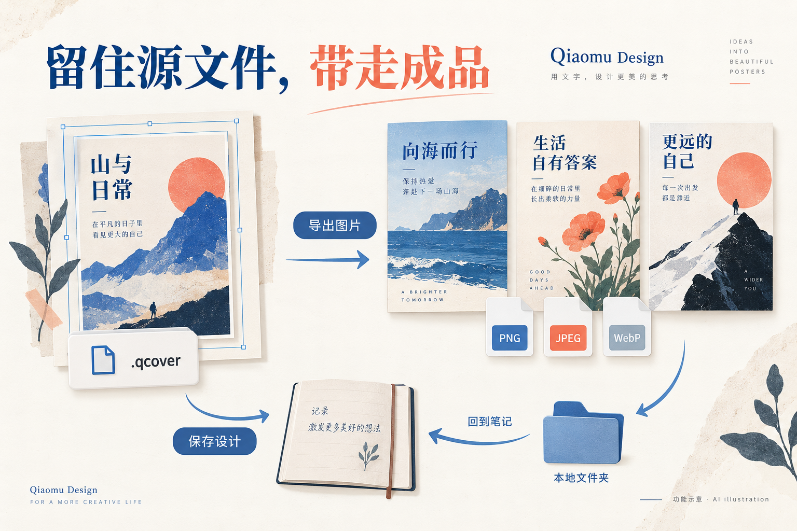

# 乔木设计 · Qiaomu Design

**中文** | [English](README.en.md)

**在 Obsidian 里，把笔记、想法和素材做成可以继续编辑的封面与海报。**

Create editable covers and posters from your notes, ideas and images—inside Obsidian.

[下载完整安装包](https://github.com/joeseesun/qiaomu-cover-design/releases/latest) · [快速开始](#quick-start) · [功能导览](#feature-tour) · [问题反馈](https://github.com/joeseesun/qiaomu-cover-design/issues)

[](https://github.com/joeseesun/qiaomu-cover-design/actions/workflows/check.yml) [](https://github.com/joeseesun/qiaomu-cover-design/releases/latest) [](LICENSE)


> 本文的蓝色与珊瑚色插图由内置 AI 生图能力制作，用来解释功能，**不是软件截图或插件生成效果承诺**。下方「真实模板输出」由本仓库模板代码实际渲染。配图来源与提示词见[制作说明](docs/images/readme/README.md)。

**桌面端 Obsidian 1.11.4+ · MIT 开源 · 基础编辑无需账号 · AI 服务按需配置**

原名 Qiaomu Cover Design，现名 Qiaomu Design。插件 ID 仍为 `qiaomu-cover-design`，设计格式仍为 `.qcover`；改名不会要求你迁移已有设计、模型配置或图片历史。本文按 **0.2.2** 实现整理。

[安装](#quick-start) · [AI 排版](#ai-layout) · [平台模板](#platforms) · [画布图层](#canvas) · [字体素材](#fonts) · [图库](#gallery) · [AI 生图](#image-ai) · [模型配置](#models) · [导出](#export) · [快捷键](#shortcuts) · [备份隐私](#storage)

## Installation and usage

Qiaomu Design creates editable covers and posters inside Obsidian, with optional AI layout, image generation, an image gallery and freehand drawing. See the [complete English guide](README.en.md).

Install the complete ZIP from [GitHub Releases](https://github.com/joeseesun/qiaomu-cover-design/releases/latest) into your vault configuration folder under `plugins/qiaomu-cover-design/`, then enable Qiaomu Design in Community plugins. Desktop Obsidian 1.11.4+ is required. Preserve plugin settings, Gallery, image jobs, fonts and caches when upgrading. Open the designer from the command palette, choose a platform, add/edit elements and export PNG/JPEG/WebP. AI is optional and uses your own configured provider.

## 为什么在笔记里做设计

一篇文章写好后，你不必把标题、正文、配图反复搬进另一个设计工具。乔木设计把画布放进 Obsidian：从当前笔记起稿，选模板或让 AI 提出排版方案，调整文字、图片与图层，导出后再放回笔记。

它适合需要持续制作小红书封面、文章头图、视频缩略图、读书卡片、课程海报的创作者，也适合想把知识笔记变成可分享图片的 Obsidian 用户。

你会得到两份不同用途的文件：**`.qcover` 留给下次编辑，PNG / JPEG / WebP 用于发布和分享**。AI 是可选的辅助能力；手工排版、模板、图层、素材、绘制与导出不要求配置模型。

## 一眼看懂全部能力

| 你想做什么 | 乔木设计怎么帮你 | 从哪里开始 |
| --- | --- | --- |
| 把一篇笔记做成封面 | 从标题、选文或笔记内容建立设计 | 命令面板 / 笔记右键 |
| 不知道如何排版 | AI 文案与版式候选，最多七个预览，选择后继续编辑 | AI 设计面板 |
| 为不同平台准备封面 | 12 个画幅预设、模板重排与安全区提示 | 平台选择器 |
| 做出统一的账号风格 | 模板、字体搭配、配色、系列风格与 A/B 方向 | 模板 / AI 设计 |
| 精细修改每个元素 | 文字样式、形状、图片、对齐、吸附、图层与分组 | 画布 / 属性面板 |
| 增添手写感和装饰 | 自由绘制、离线贴纸、线性图标、渐变背景 | 顶部插入工具 |
| 找到以前用过的图片 | 我的图片、生图任务、本地文件夹、Unsplash | 图库 |
| 生成配图或修改选区 | 独立生图、参考图编辑、继续创作，预览后再插入 | AI 生图 / 右键 AI 编辑 |
| 导出合适的成品 | 三种格式、1–3 倍、体积适配、选区透明 PNG | 导出 / 选区右键 |
| 留住可编辑源文件 | 自动保存、撤销重做、库内文件与可备份素材 | `.qcover` / 插件数据目录 |

<a id="quick-start"></a>
## 快速开始：先做出第一张封面

### 1. 安装完整包

1. 安装或更新到桌面端 **Obsidian 1.11.4 或更高版本**。
2. 打开 [GitHub Releases](https://github.com/joeseesun/qiaomu-cover-design/releases/latest)，下载 `qiaomu-cover-design-版本号.zip`。
3. 将 ZIP 中的 `qiaomu-cover-design` 文件夹放进你的库的 `.obsidian/plugins/`。
4. 重新加载 Obsidian，在「设置 → 第三方插件」启用 **Qiaomu Design**。

安装后应能看到：

```text
你的库/
└── .obsidian/plugins/qiaomu-cover-design/
    ├── main.js
    ├── manifest.json
    ├── styles.css
    ├── fonts/
    ├── assets-pack.json.gz
    └── asset-licenses/
```

完整包含字体和许可文件，适合首次离线使用。只安装 `main.js`、`manifest.json`、`styles.css` 也能运行：贴纸与图标已嵌入 `main.js`，缺失的默认字体首次使用时下载，完成后可离线使用。

**升级请合并替换发行文件，不要先删除整个插件目录。** 保留 `data.json`、`gallery/`、`image-jobs/`、自定义字体和缓存。[备份清单](#storage)解释了各目录用途。

GitHub Release 可直接下载；社区目录审核、目录可见和客户端安装是不同状态。请以 Obsidian 社区目录实际结果为准，本页不把 GitHub 发布等同于已上架。

### 2. 不配置 AI，也能完成第一张

1. 打开一篇 Markdown 笔记，在命令面板运行「从当前笔记创建封面」，或右键笔记选择同名操作。
2. 选择目标平台和模板，填写标题、副标题。
3. 双击画布文字修改内容，在属性面板调整字号、颜色与间距。
4. 从顶部工具插入图片、贴纸或形状；拖动到合适位置。
5. 打开导出，选择格式、倍率和保存位置，得到第一张成品。
6. 重新打开库中的 `.qcover`，继续修改。

**成功标志：能在库中重新打开可编辑设计，并找到导出的图片。** 默认设计目录为 `Cover designs/`，默认导出目录为 `Cover designs/Exports/`，都可在设置中修改。

### 3. 想让 AI 帮你起稿

在「设置 → 模型与服务」先添加排版模型，再在 AI 设计面板输入需求。例如：

> 把这篇关于 AI 写作的笔记做成小红书封面。标题突出“30 天学会 AI 写作”，副标题说明适合零基础；用清晰的杂志排版和蓝白配色，先不要生成图片。

比较候选方案，选择一张应用到画布，再按需要改字、换色或添加配图。**排版模型和生图模型分别配置；只有排版模型也能使用 AI 排版。**

<a id="feature-tour"></a>
## 功能导览

<a id="ai-layout"></a>
### 01 · 从一句话到可编辑版式


AI 设计面板接收主题、文章片段或修改要求，结合平台、模板和可用能力生成文案与版式建议。你可以先比较最多七个预览，再把选中的方案应用到画布。

- **从笔记开始**：命令「用 AI 把当前笔记 / 选中文字做成封面」读取选文；没有选文时使用当前笔记内容。当前实现最多取前 6,000 个字符，长文建议先选出重点。
- **继续对话修改**：要求调整配色、标题、字体或布局，随后检查画布结果。自然语言请求受当前指令协议与模型输出约束，复杂要求可拆成几步。
- **文字和布局先行**：默认不生成图片。需要图片时，可用独立「AI 生图」生成并预览后插入。
- **仍然可以手改**：通过排版指令建立的文字和形状保留各自的编辑能力。
- **对话互不干扰**：「新对话」保留画布并隔离旧聊天上下文；点击对话标题切换历史、重命名或删除，草稿随对话保存。当前编辑中，已应用消息的菜单可从该次方案创建独立画布；「从空白画布开始」也会创建单独文件。
- **清晰的作用范围**：输入区显示当前画布或选中元素。仅携带当前对话最近的成功轮次，不把失败回复作为后续指令；重开后恢复文字、状态及草稿，预览和历史画布快照限当前编辑会话。每个画布最多 30 段对话，每段保留最近 100 条消息。
- **不接模型的选择**：离线助手可解释部分中英文指令，覆盖范围小于接入模型后的自然语言设计。

可以尝试：

| 目标 | 示例需求 |
| --- | --- |
| 从长文提炼封面 | 「把这段文章提炼成一个短标题和一句副标题，做成读书卡片。」 |
| 调整风格 | 「标题用有力量的黑体，背景改成米白，强调色用蓝色。」 |
| 修改现有设计 | 「保留主要文案，缩短副标题，让主标题更突出。」 |
| 固定栏目外观 | 「沿用我的系列风格，只替换本期标题和副标题。」 |

**区别请记住：AI 排版生成可编辑元素；AI 生图与改图产生像素图片。** 在图片中画出来的字，不会自动变成可编辑文字。

<a id="platforms"></a>
### 02 · 多平台画幅、模板与系列风格


选择目标画幅后，模板会按对应尺寸构图。打开安全区参考，可避开产品预设的时长标签、头像、互动按钮等容易遮挡内容的位置。

| 内置预设 | 画布尺寸 | 使用时关注 |
| --- | --- | --- |
| 小红书 3:4 | 1080 × 1440 | 竖版图文封面 |
| 小红书 1:1 | 1080 × 1080 | 方形图文封面 |
| YouTube 缩略图 | 1280 × 720 | 右下时长区域；插件内置 2 MB 体积目标 |
| B 站封面 16:10 | 1146 × 717 | 下方播放数据区域 |
| B 站投稿 4:3 | 1200 × 900 | 信息流裁切与下方数据区域 |
| B 站高清 16:9 | 1920 × 1080 | 横版高清封面 |
| 抖音 / 视频号 9:16 | 1080 × 1920 | 下方标题与右侧按钮区域 |
| 公众号头图 2.35:1 | 1410 × 600 | 列表方形裁切时主体仍应清楚 |
| X 封面 5:2 | 1500 × 600 | 左下头像区域 |
| 通用方形 | 1080 × 1080 | 卡片、配图 |
| 通用横版 | 1920 × 1080 | 横版海报 |
| 通用竖版 | 1200 × 1600 | 竖版海报 |

以上是**插件内置预设**，不代表各平台永远不变的上传规范；发布时以目标平台要求为准。

**换比例时如何处理内容？** 使用模板创建的封面，会重新计算标题、间距和锚点；手动添加的自由元素按比例适配。没有模板的纯手工画布采用缩放适配。切换后应检查长标题、边缘配图和安全区。

模板支持保留标题、副标题后换风格；另有不同方向的 A/B 候选。A/B 指设计方案比较，不包含线上流量分流、点击率统计或增长保证。

把满意的模板、配色和字体存为「系列」，后续内容可以复用。当前最多保留六套系列，第一套作为 AI 默认风格参考；系列保存外观配置，不是整张画布副本。

#### 真实模板输出


上图使用本仓库 `src/templates.ts` 与实际字体渲染，三列依次为小红书、YouTube、公众号画幅；三行是编辑大标题、备忘录、瑞士网格。它是模板输出接触表，不是 AI 示意图，也不是 Obsidian 界面截图。[复现方式](docs/images/readme/README.md#真实模板输出)

<a id="canvas"></a>
### 03 · 画布、图层和自由绘制


你可以在同一画布内混排文字、形状、图片、贴纸、图标和手绘路径。

| 对象 / 工具 | 能做什么 |
| --- | --- |
| 文字 | 双击编辑；字体、字重、斜体、行高、字距、描边、阴影、底色；荧光笔、描边、投影、标签等预设 |
| 图片 | 插入、移动、缩放、旋转、翻转、圆角、裁剪或铺满；可继续 AI 编辑 |
| 背景 | 纯色、渐变、弥散配色；通过色盘、HEX 或可用的屏幕吸色调整 |
| 对齐 | 居中、参考线、网格、安全区和吸附；拖动时帮助维持间距 |
| 图层 | 搜索名称、改名、排序、锁定、隐藏、复制、分组与解组 |
| 多选 | 空白处拖动框选；Shift 追加；图层列表支持连续与非连续选择 |
| 右键菜单 | AI 编辑、透明 PNG 下载、命名、分组、前后层级、居中、锁定和删除 |
| 缩放 | 编辑区右下角缩放与适应画布 |

**分组保持元素独立。** 给标题、装饰线和标签编成一组后，仍可继续编辑内部元素；分组本身不会把它们压成图片。

**自由绘制**：按 `B` 开关画笔，选择颜色与 1–100 px 粗细，按 `Esc` 退出。每一笔保存为独立路径，可移动、缩放、改色、删除，逐笔撤销和重做。实现支持触控笔压力输入，但实体触控笔尚未完成本项目的硬件验收；鼠标绘制使用均匀粗细。

顶部插入工具默认用图标呈现，悬停可看名称；在「设置 → 常规 → 界面 → 顶部插入工具」可以改为图标加文字。文字和素材插入后弹层关闭，按住 Shift 可连续插入。

<a id="fonts"></a>
### 04 · 字体、配色与离线素材


默认字库提供 **34 个开源字体文件**，包括不同字重与中英文字体；模板和 AI 可使用 **12 套字体搭配**。这里的 34 指文件数，不是 34 个互不重复的字体家族。

| 搭配方向 | 典型用途 | 标题字体示例 |
| --- | --- | --- |
| 编辑杂志 / 文化书卷 | 长文、访谈、读书、人文 | 思源宋体 Heavy / 朱雀仿宋 |
| 科技产品 / 干货冲击 | AI 产品、教程、清单 | 未来荧黑 / 思源黑体 Heavy |
| 潮流种草 / 短视频 | 推荐、年轻生活方式 | 得意黑 / 抖音美好体 |
| 促销亲切 / 圆润亲切 | 活动、探店、生活 | 站酷庆科黄油体 / 江城圆体 |
| 俏皮可爱 / 温暖手记 | 亲子、宠物、成长 | 猫啃什锦黑 / 霞鹜文楷 |
| 国风书法 / 国潮热血 | 节气、传统文化、运动 | 马善政楷书 / 铁蒺藜体 |

支持本机字体，以及导入 TTF / OTF / WOFF / WOFF2。系统字体换设备后可能缺失；希望设计可移植时，优先使用默认字库或一并备份导入字体。

**默认字库的两种安装方式**：完整 ZIP 自带字体；三文件安装会从 [qiaomu-cover-fonts](https://github.com/joeseesun/qiaomu-cover-fonts) 经 jsDelivr 下载，GitHub 地址兜底，下载后按内置大小与 SHA-256 清单校验。完整库约 31 MB；未下载完成时使用系统字体，完成后可离线使用。

**贴纸与图标离线可用**：Fluent Emoji Flat 贴纸和 Lucide 线性图标压缩后嵌入 `main.js`，三文件安装也不依赖额外素材下载。字体采用 SIL OFL，素材许可与来源见 [THIRD_PARTY.md](THIRD_PARTY.md)。示意图中的装饰只用于说明，不代表素材目录逐项截图。

<a id="gallery"></a>
### 05 · 一个图库，管理四类来源


从顶部「图库」进入，统一预览与选取素材。一次最多插入 **24 张**图片，整批插入可以一步撤销。

| 页签 | 用法 | 删除 / 隐藏的含义 |
| --- | --- | --- |
| 我的图片 | 合并生成与上传结果；搜索、筛选、预览、重命名、多选 | 删除对应图库文件；已嵌入封面的独立副本不受影响 |
| 生图任务 | 看状态与结果；重命名；取回提示词和参考图继续编辑 | 删除任务记录保留生成图片，清理任务提示词与参考文件 |
| 本地文件夹 | 添加目录引用，查看直接包含的 PNG/JPEG/WebP，刷新与插入 | 只从图库隐藏，可恢复；不删除原文件 |
| Unsplash | 配置 Access Key 或代理后，浏览推荐照片、搜索、插入 | 远程照片不作为本地图库文件批量删除 |

本地文件夹不递归扫描、不跟随符号链接；插入时才把图片内嵌到设计。移除文件夹引用不会删除文件夹。

图库上传支持按钮和拖放：单张上限 **30 MB、36 MP**；本地文件夹单张读取上限 30 MB。直接向画布导入走另一条路径，上限 **25 MB**，并可能压缩大图。图库接收成功不等于任何大图都能不经处理直接插入画布。

批量删除前会显示数量并确认；失败项目保留选中，便于重试。编辑任务提示词只是填入表单，**再次确认生成才请求模型**。Unsplash 插入会保留摄影师和来源链接，并调用其下载跟踪接口。

<a id="image-ai"></a>
### 06 · AI 生图、参考图编辑与继续创作


**独立生图**：打开「AI 生图」，先选模型、比例与可用参数，再写提示词、添加参考图，确认提交。默认留在弹窗等待并显示计时，完成后先预览；你也可以主动放到后台，继续编辑其他设计。

后台完成后通过通知查看结果，或从「图库 → 生图任务」找回。关闭弹窗不会自动丢弃已完成结果，也不会自动把生成图塞进画布。任务按返回结果保留图片，多图结果可以选取后插入。

**选区改图**：选中图片、文字、形状、分组或多个元素，右键「AI 编辑」或在属性面板选择「用 AI 编辑」，输入修改要求。

| 输入 | 发送给图片服务的内容 | 结果如何使用 |
| --- | --- | --- |
| 单张位图 | 原始图片作为参考 | 插入副本，或替换原图 |
| 文字 / 形状 / 分组 / 多选 | 仅选区渲染成的透明 PNG，不含未选元素 | 插入副本，或以一张位图替换原选区 |
| 上一轮生成结果 | 选中的结果作为下一轮参考 | 输入新要求后继续创作 |

单图替换保留位置、大小、旋转、镜像、裁剪、遮罩和层序，并支持撤销。如果生成期间原选区被修改或删除，插件会拒绝直接替换，仍可插入副本。

**替换文字或矢量选区会失去这部分原有的文字 / 矢量编辑能力，因为结果是一张位图。** 可通过撤销恢复原元素；如果还需要逐字修改，优先插入副本或保留源设计。

内置生成与改图提示词可点击填入草稿，支持保存自己的提示词。预设包括极简背景、纸艺海报、产品摄影、编辑插画，以及换背景、水彩、卡通、素描、清晰修复等。纯色背景不等于透明抠图。

<a id="models"></a>
#### 配置模型与服务

在「设置 → 模型与服务」分别管理**排版模型**和**生图模型**：添加服务、接口地址、密钥、模型 ID，设置默认项。支持搜索和别名；别名只改变显示名称，不会改变真实请求的模型 ID。编辑非默认模型不会自动切换当前模型。

| 接入方向 | 用途 | 使用前提 |
| --- | --- | --- |
| OpenAI 兼容 / Claude 排版服务 | 文案、设计方案与画布指令 | 自备接口、密钥和可用模型 |
| Codex CLI | 本机调用对应 AI 能力 | 本机安装并配置 CLI 及账户；不是插件免费赠送额度 |
| Seedream / 火山方舟 | 生图、版本支持的参考图编辑等 | 账户开通对应模型或接入点 |
| 即梦兼容服务 | 生图与独立的参考图编辑协议 | 兼容接口、模型与授权；不是即梦网页自动化 |
| 其他已支持图片协议 | 依所选适配器使用服务 | 按设置中的协议与模型能力填写 |

Seedream 的参考图数量、组图、分辨率、透明编辑和拆层随版本变化；即梦编辑使用独立 compositions 协议。详细能力与限制见 [AI 模型说明](docs/AI-MODELS.md)。**模型出现在列表里不代表你的账户已开通。**

云端请求可能收费。插件不自动重新提交失败的付费生成请求；重载可能中断连接，但本机中断不代表服务商已经取消生成或退款。已完成结果可恢复，失败后由你决定是否新建请求。

<a id="export"></a>
### 07 · 保存源文件，导出适合发布的图片



导出时先确认尺寸、格式、质量和预计体积，再决定保存位置与是否回写笔记。

| 设置 | 可选方式 |
| --- | --- |
| 格式 | PNG / JPEG / WebP |
| 清晰度 | 1× / 2× / 3× |
| 体积 | 调整质量；对内置体积限制尝试自动压缩，最终仍应检查成品 |
| 目的地 | 库内文件夹、来源笔记所在目录、用户选择的系统文件夹 |
| 文件名 | 模板变量 `{name}`、`{platform}`、`{size}`、`{date}`、`{time}` |
| 后续操作 | 按需插入来源笔记、写入 `cover` 属性、复制到剪贴板 |

例如，默认文件名模板 `{name}-{platform}` 可以把「AI 写作」的小红书设计导出成带 `xhs` 标记的文件。重复导出会选择新文件名，避免直接覆盖已有成品。

**只导出某个元素**：选中一个或多个元素，右键下载选区透明 PNG。按选区边界裁切、保留层序，最长边限制为 4096 px；选择保存位置后写入，取消则不写入。

保存设计和导出成品是两件事：`.qcover` 用于继续编辑，图片用于发布。插件不自动登录或发布到小红书、公众号、YouTube 等平台。

<a id="shortcuts"></a>
## 快捷键与高频操作

以下快捷键在设计画布获得焦点时使用；编辑文字时会保留正常输入行为。macOS 使用 `⌘`，Windows / Linux 对应 `Ctrl`。

| 操作 | 快捷键 / 手势 |
| --- | --- |
| 撤销 / 重做 | `⌘/Ctrl + Z` / `⌘/Ctrl + Shift + Z` |
| 保存 | `⌘/Ctrl + S` |
| 复制所选对象 | `⌘/Ctrl + D` |
| 全选可选元素 | `⌘/Ctrl + A` |
| 分组 / 解组 | `⌘/Ctrl + G` / `⌘/Ctrl + Shift + G` |
| 命名图层 | `F2` |
| 删除所选 | `Delete` |
| 移动 / 大步移动 | 方向键 / `Shift + 方向键`（10 px） |
| 开关自由绘制 / 退出 | `B` / `Esc` |
| 追加框选 / 多选 | `Shift + 拖动` / `Shift + 点击` |
| 图层非连续 / 连续选择 | `⌘/Ctrl + 点击` / `Shift + 点击` |
| 连续插入文字或素材 | 插入时按住 `Shift` |

<a id="storage"></a>
## 文件、备份和隐私

### 你的数据存在哪里

| 数据 | 默认位置 | 迁移时注意 |
| --- | --- | --- |
| 可编辑设计 | 库内 `Cover designs/*.qcover` | 图片内嵌；大图会增大设计文件 |
| 导出成品 | 库内 `Cover designs/Exports/`，或你指定的位置 | 系统文件夹中的成品需另行备份 |
| 导入字体 | 库内 `Cover designs/Fonts/` | 连同字体许可一起保留 |
| 插件配置 / 近期对话 | `.obsidian/plugins/qiaomu-cover-design/data.json` | 含本地设置与模型配置，谨慎同步与分享 |
| 上传图片副本 | 插件目录 `gallery/` | 删除图库项会删除对应副本 |
| 生图结果 / 任务 | 插件目录 `image-jobs/` | 要保留历史结果时一并备份 |
| 默认字库 | 插件目录 `fonts/` | 完整包自带，或首次下载 |
| 本地文件夹图片 | 你引用的原始目录 | 引用不会搬走原文件；迁移设备后检查目录路径 |

自动保存有写入冲突保护，但不能代替备份。不要在两个设备上同时改同一个设计文件。升级插件前保留上述数据；卸载或手工删除插件目录可能一并丢失图库、任务与配置。

乔木 Home 集成可显示最近设计、创建入口和设计搜索；没有安装 Home 也可以正常使用设计插件。

### 哪些操作会联网

基础画布编辑不上传设计，插件不收集客户端遥测。以下功能有各自的网络或本机访问边界：

| 行为 | 数据去向 / 权限边界 |
| --- | --- |
| 默认字体下载 | GitHub / jsDelivr 获取字体资源；校验完整性 |
| AI 排版 | 用户指定的模型端点收到提示词、相关文字和画布上下文 |
| AI 生图与改图 | 所选服务收到提示词及使用的参考图片 / 选区图 |
| Unsplash | 搜索、照片加载和插入下载跟踪；密钥由 Obsidian 密钥存储管理 |
| 关于页 | 加载 `radio.qiaomu.ai` 上的关注 / 赞助二维码图片 |
| Codex CLI | 启动本机进程，使用你配置的 CLI 账户与服务 |
| 本地图库 / 系统导出 | 可访问你选择的库外文件夹；本地图库不删除原件 |

模型密钥不写入 `.qcover` 设计文件；AI 服务配置位于本地插件设置中，**不应将 `data.json` 当作可公开分享的无敏感文件**。自定义端点与代理由你选择，请根据服务条款判断是否提交私人笔记和图片。

插件免费，赞助是自愿行为，不解锁额外功能；模型服务、网络图片与字体各自遵守对应服务条款和许可。

## 常见问题

<details>
<summary><strong>没有 AI 账号能用吗？</strong></summary>

可以。模板、文字、图片、图层、贴纸、绘制、保存和导出可独立使用。AI 排版和生图需要另行配置；三文件安装的默认字体初次获取需要联网，完整 ZIP 更适合离线安装。

</details>

<details>
<summary><strong>字体没有出现，或换电脑后样式变了？</strong></summary>

在设置的字体页检查默认字库就绪状态。网络受限时使用完整 ZIP 中的字体，或等待下载重试。系统字体依赖当前设备；使用默认字库、备份导入字体更便于迁移。字体未就绪时系统回退会影响换行与视觉效果，导出前检查画面。

</details>

<details>
<summary><strong>为什么 AI 返回图片后没有自动替换画布？</strong></summary>

结果需要你预览并选择插入或替换，这是正常流程。后台任务从图库的生图任务中找回。生成期间原选区若已改变，不能直接替换旧目标，可以插入副本。

</details>

<details>
<summary><strong>配置了模型，为什么仍然报错？</strong></summary>

先检查服务类型、接口地址、模型 ID、账户权限和余额。模型别名不参与请求；列表出现模型也不代表账户已开通。401 通常与认证有关，429 需要结合服务返回判断限流或配额。保留错误信息，避免反复重提可能收费的生成请求。提 Issue 时隐藏密钥、参考图和私人提示词。

</details>

<details>
<summary><strong>删除图库图片会把设计里的图一起删掉吗？</strong></summary>

已经插入设计的图片是独立嵌入副本，不随图库项删除。本地文件夹项只隐藏，不删除原件；删除任务记录保留生成图片。迁移时仍应备份图库和任务目录，才能继续查找历史素材。

</details>

<details>
<summary><strong>为什么文字经过 AI 改图后不能逐字编辑？</strong></summary>

图片服务返回的是像素图。选区替换会把原选区变成图片；可撤销恢复，或选择插入副本。需要保持文字可编辑时，使用 AI 排版或直接在画布上修改文字。

</details>

<details>
<summary><strong>支持手机、公开分享链接、自动发社交平台吗？</strong></summary>

当前仅支持桌面 Obsidian。没有托管设计分享服务、社交平台自动发布或矢量路径节点编辑器。导出后由你在目标平台发布。

</details>

## 开发、验证与项目结构

推荐使用 Node.js 22（与仓库 CI 一致）和 npm。

```sh
git clone https://github.com/joeseesun/qiaomu-cover-design.git
cd qiaomu-cover-design
npm ci --ignore-scripts
npm run check
```

`check` 依次运行 ESLint、测试、TypeScript 检查和生产构建。产物为根目录的 `main.js`；开发安装还需要 `manifest.json` 与 `styles.css`。基础构建不需要完整字体二进制；打包完整 ZIP 则需要校验通过的字体及许可文件。

<details>
<summary>其他开发命令与完整打包</summary>

| 命令 | 用途 |
| --- | --- |
| `npm run dev` | 监听源码并构建 |
| `npm test` | 自动化测试 |
| `npm run lint` | 源码规范检查 |
| `npm run audit` | 项目模板审计（不是 npm 依赖审计） |
| `npm run eval` | 意图案例评估 |
| `npm audit --omit=dev` | 生产依赖安全审计 |
| `npm run gallery` | 模板输出图库；需先准备 `assets/fonts/index.json` 和字体 |
| `npm run package` | 构建完整 ZIP，并校验字体大小、SHA-256 和许可 |

完整字体可从当前完整发行 ZIP 的 `fonts/` 复制到 `assets/fonts/`，须与当前 `src/fontmanifest.ts` 一致；重新生成字体库见 `scripts/build-font-library.py`（需要 fonttools 和 brotli）。图库索引准备见[媒体复现说明](docs/images/readme/README.md)。完整打包仅使用 `npm run package`，输出位于 `artifacts/`。

仓库的 `npm run deploy` 包含维护者本机 QA 路径，不是通用安装命令；请按快速开始手动复制发行文件到自己的测试库。

</details>

| 目录 / 文件 | 职责 |
| --- | --- |
| `src/main.ts`、`src/view.ts` | Obsidian 插件入口与设计画布 |
| `src/templates.ts`、`src/platforms.ts` | 模板、尺寸、安全区 |
| `src/ai.ts`、`src/ops.ts`、`src/aiparse.ts` | AI 排版、受限操作协议与解析 |
| `src/imagegenerate.ts`、`src/imagejobs.ts` | 生图表单、任务和结果 |
| `src/seedream*.ts`、`src/jimeng*.ts`、`src/codex.ts` | 不同服务协议适配 |
| `src/gallery*.ts`、`src/fonts.ts` | 图库、文件夹与字体服务 |
| `tests/`、`tests/host/` | 自动化逻辑测试与宿主验收脚本 |
| `docs/` | 设计方法、平台说明、验证记录与本文配图 |

运行时以 Obsidian FileView、Fabric.js 7 和 perfect-freehand 实现；不打包 React 或 Next.js，不加载远程可执行代码。AI 输出通过有限画布指令应用，模型不获得任意导出或文件读写指令。

### 验证范围

本次文档核验基于 0.2.1 源码，并于 **2026-10-10** 运行 `npm run check`：104 项测试中 **103 通过、1 跳过、0 失败**，ESLint、TypeScript 与生产构建通过；生产依赖审计当次为 0 漏洞。跳过项为缺少原生 Canvas 二进制的全模板布局检查；本文另通过浏览器渲染了 3 个模板 × 3 种尺寸，不替代全量宿主验收。

[0.2.1 验收记录](docs/RELEASE-0.2.1.md)另记录了真实 Obsidian 1.14.4 的图库、绘制、工具栏等测试，以及 Seedream 5.0 Lite 和即梦 4.5 生图 / 参考编辑实测。**这些是既有版本验收记录，不是本次写文档重新执行的付费模型测试。**

Windows / Linux、实体触控笔、Codex 图片编辑、弹出窗口尚未完成记录中的验收；其他图片模型版本有协议与参数测试，不等于逐版本实际付费输出认证。更多细节见[验证记录](docs/VERIFICATION.md)。

## 来源、贡献与作者

本项目由同一作者的 [cover4xiaohongshu](https://github.com/joeseesun/cover4xiaohongshu) 改造，保留其 Git 历史；插件运行时使用 Obsidian FileView 与 Fabric 独立实现。[原项目分析](docs/ANALYSIS.md)说明功能映射，[第三方声明](THIRD_PARTY.md)列明字体、贴纸、图标和代码许可。

欢迎[提交问题](https://github.com/joeseesun/qiaomu-cover-design/issues)与改进 PR。复现信息应包含插件版本、Obsidian 版本、系统、操作步骤及不含敏感内容的截图。开发协作见 [CONTRIBUTING.md](CONTRIBUTING.md)，安全报告见 [SECURITY.md](SECURITY.md)，交流遵循[行为准则](CODE_OF_CONDUCT.md)。

**向阳乔木** · [个人站](https://qiaomu.ai) · [博客](https://blog.qiaomu.ai) · [乔木推荐](https://tuijian.qiaomu.ai) · [X @vista8](https://x.com/vista8) · [GitHub @joeseesun](https://github.com/joeseesun) · 公众号「向阳乔木推荐看」

[MIT License](LICENSE) © 向阳乔木。第三方字体、素材保留各自许可。
