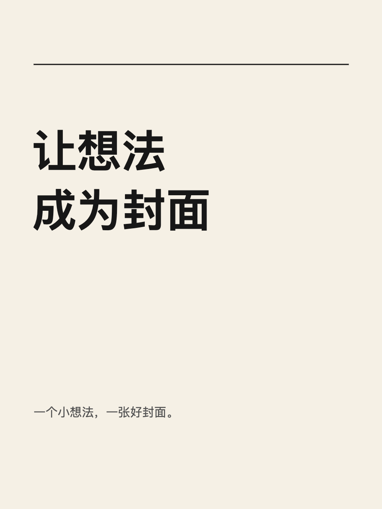

# Qiaomu Cover Design · 乔木封面设计

在 Obsidian 中，把笔记标题和选文做成封面。离线编辑，设计文件与 PNG 都保存在你的库内。

基于 [cover4xiaohongshu](https://github.com/joeseesun/cover4xiaohongshu) 改造，保留上游 Git 历史；插件代码采用原生 Obsidian FileView 与 Fabric.js 7 重新实现。[原项目分析与功能映射](docs/ANALYSIS.md)。



## 功能

- **平台预设**：小红书 3:4 / 1:1、YouTube 缩略图、B 站、抖音 / 视频号、公众号头图、X 封面等；切换平台时内容按比例适配，并可显示平台安全区（时长标签、数据条等会遮挡的区域）。
- **默认字库**：随插件提供 34 个精选开源字体（思源黑体 / 宋体三字重、朱雀仿宋、霞鹜文楷、得意黑、抖音美好体、未来荧黑、江城圆体等中文字体，以及 Inter、Fraunces、Instrument Serif 等英文字体），覆盖《通用规范汉字表》8105 字，全部 SIL OFL 授权，装好即用，不需要装进电脑系统。模板与 AI 以 12 套「字体搭配」排版。也能使用本机字体、导入 TTF / OTF / WOFF / WOFF2，或在字体库一键下载更多。
- **10 个模板**，套用时保留你的标题与副标题；文字预设（荧光笔、描边、投影、标签）、形状、本地 / 库内 / 粘贴 / 拖入图片（超大图自动压缩）。
- 文字：字重、斜体、行高、字距、描边、阴影、底色；图片圆角、翻转、铺满；纯色与渐变背景；吸附参考线、对齐、图层拖拽排序、锁定、复制粘贴、右键菜单。
- **导出**：PNG / JPEG / WebP，1–3 倍，超出平台限制（如 YouTube 2MB）自动压缩；位置可选库内文件夹、笔记所在文件夹或系统文件夹；文件名模板；导出后可插入笔记、写入 `cover` 属性、复制到剪贴板。
- **对话面板**：所有操作已抽象为指令协议，当前提供离线中文 / 英文指令；其他插件可通过 `registerAssistant` 接入模型。
- `.qcover` 自动保存；撤销 / 重做；冲突不覆盖；乔木 Home 集成；中文 / English。

## 安装与使用

开发源码在 `main`；测试候选安装包保留为草稿 Release，官方预扫描完成后才公开。

开发版本安装：检出 `main` 分支，运行 `npm ci && npm run build`，将根目录的 `main.js`、`manifest.json`、`styles.css` 放入库的 `.obsidian/plugins/qiaomu-cover-design/`，在第三方插件中启用。

命令面板选择「新建封面」或「从当前笔记创建封面」。也可右键 Markdown 笔记创建。双击画布文字可直接输入，选中对象后在属性面板修改；打开库中的 `.qcover` 文件继续编辑。

设计默认放在 `Cover designs/`，PNG 默认放在 `Cover designs/Exports/`；均可在设置中修改。导出到来源笔记会在笔记末尾添加图片链接。重复导出创建新文件，不覆盖已有 PNG。

画布聚焦时：⌘/Ctrl+Z 撤销、Shift+⌘/Ctrl+Z 重做、⌘/Ctrl+D 复制、⌘/Ctrl+S 保存、Delete 删除、方向键移动，Shift+方向键移动 10px。文本编辑期间保留正常输入快捷键。

## 隐私与边界

不收集遥测。离线编辑不上传画布；字体库下载、Unsplash 搜索与用户主动提交的 AI 请求会联网。图片编辑会将所选参考图片发送给指定模型。只接受 PNG/JPEG/WebP，导入单张不超过 25MB，图片内嵌于设计文件，可随库同步。设计中远程图片和 SVG 地址会被拒绝。系统文件夹导出与 Codex CLI 使用桌面端本机能力。

默认字库首次打开时在后台静默下载（约 31 MB，来自 [qiaomu-cover-fonts](https://github.com/joeseesun/qiaomu-cover-fonts) 经 jsDelivr 分发，GitHub 兜底），逐个校验 SHA-256 后存入插件目录，之后离线可用；下载失败的字体下次打开自动补，期间用系统字体兜底。完整安装包已自带字库，无需下载。导入的字体存在库内并随库同步，系统字体换设备时可能不同。首版仅支持桌面端，最低 Obsidian 1.8.7。语言设置在重新打开设计标签页后生效。剪贴板取决于系统权限，失败时可使用 PNG 导出。

支持 AI 文案与版式候选、按需生成主体/背景图、Unsplash 搜索及内置字体；未移植网页的公开分享、手绘和路径编辑等全部能力。当前仍处于开发候选阶段，未提交或通过 Obsidian 官方目录审核。

## 开发

```sh
npm ci
npm run check
npm run dev
```

`check` 包含 lint、数据/安全/并发/i18n 测试与类型检查、生产构建。产物只外置 `obsidian`，不带 Next.js、React 或远程加载的可执行代码；Codex CLI 使用桌面端本机进程。`npm ci` 安装的 Fabric 可选 Node canvas 不参与浏览器 bundle。

[测试与发布状态](docs/VERIFICATION.md) · [来源与许可](THIRD_PARTY.md) · [问题反馈](https://github.com/joeseesun/qiaomu-cover-design/issues)

MIT © 向阳乔木。


## AI 设计师（一句话出整版封面）

设置 → AI 设计师里填入 OpenAI 兼容接口或 Claude 的地址、密钥和模型名，即可在左侧「AI 设计」里粘贴一段话：模型会选平台、模板、文案和配色并自动排版；开启生图后还会生成背景或图位配图。内置 18 个模板（含数字干货、油管冲击、B 站热血、对比、金句卡、新粗野等）和按平台分组的起手提示词。命令「用 AI 把当前笔记 / 选中文字做成封面」可直接从笔记生成。

模型只能返回有限的画布指令（不能导出、读写文件）；文字与画布摘要只会发送到你填写的地址。不接入模型时插件完全离线。


## Offline asset pack

`assets/pack.json.gz` (Fluent Emoji Flat stickers, MIT, and Lucide line icons, ISC) must be installed beside `main.js` as `assets-pack.json.gz`. Rebuild it with `python3 scripts/build-asset-pack.py`.


## Bundled fonts

The default font library is built by `scripts/build-font-library.py` (needs fonttools and brotli): it writes `assets/fonts/` (font files, `licenses/`, `index.json`) and the compiled manifest `src/fontmanifest.ts`, and `--publish <dir>` copies it into a checkout of [qiaomu-cover-fonts](https://github.com/joeseesun/qiaomu-cover-fonts). Store installs fetch the files on first run; `npm run package` ships them in the zip as a `fonts/` folder.

### AI 封面设计

输入主题或粘贴文章，先比较最多七个文案与版式预览，点击方案后应用到可编辑画布。默认不生成图片；在「配图可选」里选择「本次生成配图」，或应用方案后点击「添加配图」。图片服务配置与本次生成选择独立，正常排版处理不再逐条展示。

### AI 生图

画布编辑区顶部的「AI 生图」可直接调用已配置的 Codex CLI、Seedream 或其他生图模型。提交后默认留在弹窗等待并展示结果，也可主动「放到后台」继续编辑或切换设计；后台完成后通知「查看结果」，所有模型先预览，再选择要插入的图片。4K 输出保留原始分辨率。结果保存在插件目录的 `image-jobs/`，不包含 API 密钥；关闭弹层不会丢失结果，也不会自动插入。命令「生图任务」或生图弹层里的同名入口可找回已完成结果。插件重载后已完成结果可恢复；正在生成的连接若中断，不自动重新提交收费请求。失败保留提示词，由你手动提交新任务。

选中图片后，右键的「AI 编辑」或属性面板的「用 AI 编辑」，输入修改要求；原始图片会作为参考输入发送给 Seedream、即梦或 Codex CLI。先预览结果，再选择「插入副本」或「替换原图」。替换保留位置、大小、旋转、镜像、裁剪、遮罩和图层顺序，支持撤销和保存重开。图片内文字仍是像素；拆层结果也属于图片图层。

Seedream 使用[火山方舟图片生成 API](https://docs.volcengine.com/docs/ark/image-generation-api?lang=zh)，支持以下能力。每次根据所选版本显示合法选项；接入点 ID 可在「生图选项」指定实际版本，选择会保存在该模型配置中。

| 版本 | 原图 / 多图编辑 | 组图 | 分辨率档位 | 专属能力 |
| --- | --- | --- | --- | --- |
| 3.0（兼容） | 无，仅文生图 | 无 | 指定像素 | 随机种子、提示词权重 |
| 4.0 | 最多 14 张参考图 | 最多 15 张，参考图与结果合计 ≤15 | 1K / 2K / 4K | 标准 / 快速提示词优化 |
| 4.5 | 最多 14 张参考图 | 同上 | 2K / 4K | 标准提示词优化 |
| 5.0 Lite | 最多 14 张参考图 | 同上 | 2K / 3K / 4K | 联网搜索、PNG / JPEG |
| 5.0 Pro / Flash | 最多 10 张参考图 | 单图 | 1K / 1.5K / 2K | PNG / JPEG、透明原图编辑、图层拆分；Pro 还支持快速优化 |

支持自定义像素尺寸、URL / Base64 返回和水印开关，按版本检查总像素与比例限制。参考图入口接受 PNG / JPEG / WebP；透明编辑需要一张透明 PNG，拆层需要一张 PNG / JPEG。拆层按返回的层序与边界框复原为组合，可取消组合后独立移动、缩放、旋转；组图的数量是上限，实际张数由模型决定，部分失败会显示原因并保留成功结果。当前采用非流式请求，生成后默认留在弹窗中显示等待动画与真实计时，返回后展示预览；也可主动放到后台。模型须在方舟账户中开通，模型列表可见不代表已经开通；旧版模型的可用性以控制台为准。

### 即梦兼容与快捷提示词

已有「自定义」配置可直接识别 `jimeng-api` 地址或国内图片模型 ID，不限定域名。按最近支持比例发送 `ratio`，默认 `resolution:2k`；可选 1K / 2K / 4K。模型列表保留接口返回并补齐国内七个版本的后端映射候选，排除视频；候选不等于当前账号已开通。一次返回的所有图片进入同一个后台任务，支持多选插入。HTTP 200 的业务错误、401、429 与图片下载错误都保留，不自动重发生成 POST。即梦参考图编辑独立调用 `/images/compositions`，支持最多 10 张参考图；URL 采用 JSON，本地图片采用 multipart 上传，不套用 Seedream 字段；普通 OpenAI、Ark、Gemini、OpenRouter、Codex 协议继续独立使用。

默认快捷提示词包括极简背景、纸艺海报、产品摄影、编辑插画；改图提供换背景、纯色背景、水彩、卡通、素描和清晰修复。点击仅填入草稿，确认生成才发送；可编辑、删除或保存自己的提示词。纯色背景不等于透明抠图，改图不会改变像素文字的可编辑性。参考 [poster-studio](https://github.com/joeseesun/poster-studio/tree/a5e991ccabf30edf50d5e7ce8a8a4f47728b1d1d) 的提示词与图生图交互重新实现。

鼠标从画布外、空白处或铺满的背景上拖动可框选前景；Shift 框选追加，锁定与隐藏图层不参与，背景只有完整框入才选中。Shift 点击继续使用 Fabric 原生多选，⌘/Ctrl+A 可选中全部可选元素。

图层面板支持名称搜索、⌘/Ctrl 点选、Shift 连选、批量命名及可折叠分组。⌘/Ctrl+G 分组、⌘/Ctrl+Shift+G 解组，F2 命名；组内元素保持可编辑，分组不会合并成位图。生图弹窗先选模型和比例，再写提示词、添加参考图，高级参数默认折叠。模型发现提供完整下拉列表，也保留手动填写模型 ID；参考图用自定义按钮和缩略图展示。

设置 → 模型与服务：排版模型与生图模型各自按服务分组，支持名称/ID 搜索、编辑及设为默认。显示名称默认采用模型名，可改为自己的别名，清空后恢复默认；别名不改变实际请求中的模型 ID。密钥和接口地址在模型配置弹窗中维护，编辑非默认模型不会切换当前模型。设置 → 字体：首屏显示内置字库就绪状态、浏览字库和导入入口，只列出额外添加的字体；已安装字体包隐藏，存储、系统扫描和许可信息默认折叠。

选中图片、文字、形状、分组或多个元素，可通过右键的「AI 编辑」或属性面板的「用 AI 编辑」继续编辑。单张位图发送原始图片；其他选区合成透明 PNG 参考图，不包含未选元素。结果支持插入副本或替换原选区（替换为一张位图，原有文字/矢量编辑性可通过撤销恢复），原元素修改或删除后拒绝替换，仍可插入副本。选一张结果「继续创作」会以该结果作为下一轮参考，展示上一轮要求，输入新指令后才发送。每轮结果留在生图任务里供回看。


### 编辑工具栏与选区操作

顶部的 AI 生图、文字、素材入口跟随编辑区左侧对齐；形状、图片与背景摄影在「插入其他」中。默认仅显示图标，悬停显示名称；在「设置 → 常规 → 界面 → 顶部插入工具」可切换图标和文字，已打开的画布即时更新。文字和素材使用各自的插入弹层，插入后关闭，按住 Shift 可连续插入。窄窗口自动换行。缩放与适应控件缩小至 30px 高，固定编辑区右下角，适应画布时为它留出空间。AI 对话框不再提供重复的「配图」入口。后台结果通知使用紧凑按钮，说明与操作之间保留独立间距。

选中元素右键可 AI 编辑、下载选区透明 PNG、命名、分组/解组、复制/粘贴、调整前后层级、居中、锁定/解锁和删除。PNG 按选区边界裁切，保留画布层序，最长边限制为 4096px；下载会询问保存位置，取消不写入。组内排序与同组分组保留世界坐标并支持撤销。吸附使用当前拖动边界，锁定已吸附的边缘/参考线组合，移出释放范围再跟随鼠标，距离随缩放换算。

颜色控件统一为对齐的方形色块：点击主色块打开色盘，可用色域、色相、HEX 或屏幕吸色调色。一次色盘调整可一次撤销。弥散预设以 10 款马卡龙浅色为主，两款深色置后；旧封面配色仍可恢复。悬浮提示仅在无文字图标等必要位置使用宿主样式，色块及有明确名称的卡片不重复提示。
